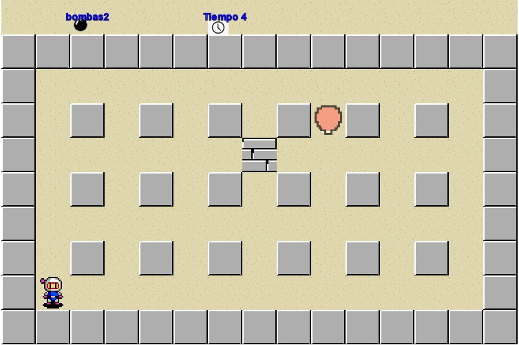
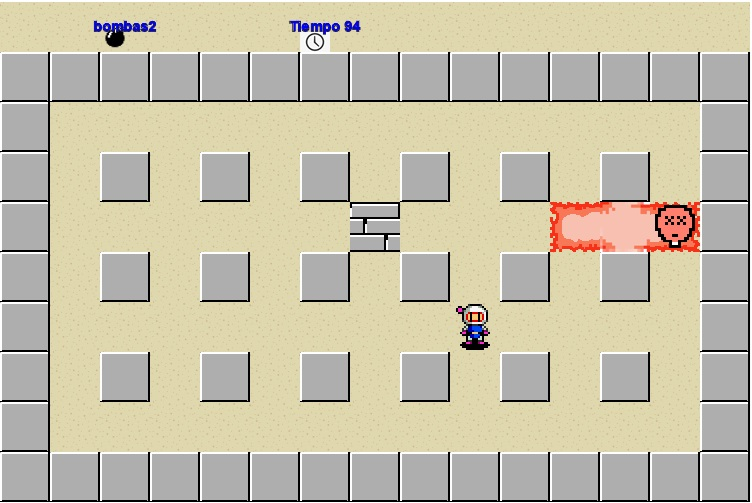

# Bomberman (ver si le cambiamos el nombre)

## Equipo de desarrollo

- Federico Sordi
- Lautaro Farias
- Lautaro Milrad
- Jonathan Puyol
- Nahuel Montero

## Capturas

## Reglas de Juego / Instrucciones

Reglas:
Hay que encontrar la salida destruyendo bloques con las bombas para pasar al siguiente nivel. Cuidado con los enemigos y tus propias explosiones!

Botones:
- w/flecha arriba -> Moverse hacia arriba
- a/flecha izquierda -> Moverse hacia la izquierda
- s/flecha abajo -> Moverse hacia abajo
- d/flecha derecha -> moverse hacia la derecha
- spacebar -> poner bombas

## Otros

- POO I - UNAHUR
- Versión de wollok: 4.0.0
- Una vez terminado, no tenemos problemas en que el repositorio sea público
